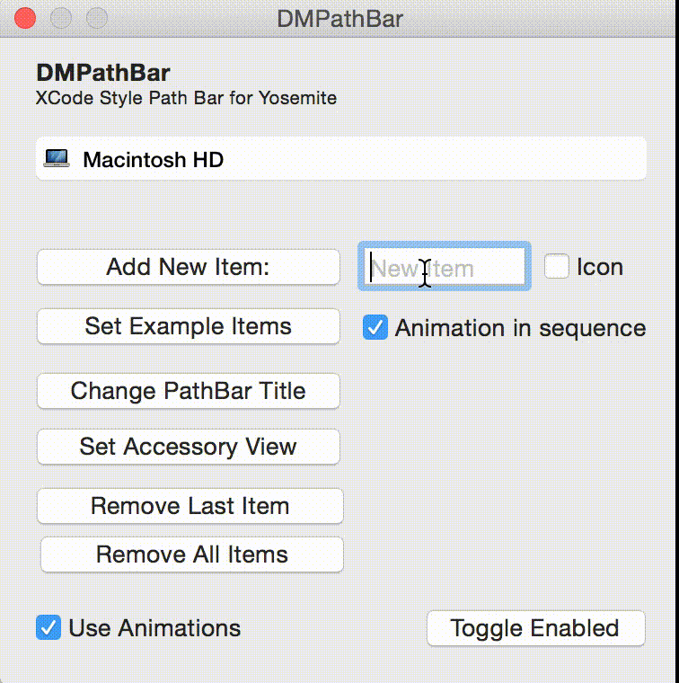

# DMPathBar

[](https://travis-ci.org/Daniele Margutti/DMPathBar)
[](http://cocoadocs.org/docsets/DMPathBar)
[](http://cocoadocs.org/docsets/DMPathBar)
[](http://cocoadocs.org/docsets/DMPathBar)

DMPathBar is a Path Bar Cocoa control like the one used in XCode to pick Targets or Finder in Yosemite (aka MacOS X 10.10) while browsing along a path.

I've made it to looks great in Yosemite but you can easily customize it for your needs.

As many other Yosemite controls, DMPathBar fully support animations for each available operation (add/set/remove/replace items) using a modern block style syntax.

<div style="width:100%;">

</div>

<p><p>

## A short introduction

To run the example project, clone the repo, and run `pod install` from your project.

Then you can create a new DMPathBar from IB by dragging a new custom view instance and set it to 'DMPathBar'.
You can also create it programmatically:

```
NSImage *myIcon = ...;
NSString *myTitle = ...;
DMPathBarItem *titleItem = [DMPathBarItem itemWithTitle: myTitle icon: myIcon];

self.pathBar = [[DMPathBar alloc] initWithFrame:NSMakeRect(0.0f,0.0f,300.0f,25.0f)];
[self.pathBar setTitleItem: titleItem animated:NO completion:NULL];
```
Each path item of the tabbar is a DMPathBarItem.
You can create new path bar with title&icon, only title or only icon (`+itemWithTitle:icon:`).

DMPathBarItem can also hold custom views too (using `+itemWithCustomView:`)

#### Actions

You can respond to the click event inside one of the path bar items by implementing the `.action` property defined as a block:

`typedef NSMenu*(^DMPathBarAction)(NSInteger index,DMPathBarItem *item);`

If you return an NSMenu instance your click on the item will open passed menu as contextual menu.
If you return nil it's just a simple click.

That's an example:

 ```
	pathBar.action = ^NSMenu *(NSInteger idx,DMPathBarItem *item) {
		NSLog(@"Tap on item %ld : %@",idx,item);
		
		if (idx == 0) {
			// Click on the title item will show a menu
			NSMenu *menu = [[NSMenu alloc] initWithTitle:@""];
			[menu addItemWithTitle:@"Item 1" action:@selector(test:) keyEquivalent:@""];
			[menu addItemWithTitle:@"Item 2" action:@selector(test:) keyEquivalent:@""];
			return menu;
		} else {
			// Do something with other items
			return nil;
		}
	};
}
 ```

#### Set Title Item

This method add or replace the existing title of the pathbar:

```
DMPathBarItem *item = ...;
[self.pathBar setTitleItem: titleItem animated:NO completion:NULL];
```

#### Set Items

You can set more than one items at once by using `-setItems:...` methods.
There are two setItems methods based upon the type of the animation you want to achieve.
If you want a single set animation you can use:

 ```
NSArray *items = @[pathItem1,pathItem2...];
[self.pathBar setItems: items animated:YES inSequence:NO completion:NULL];
```

while if you want a single animation for each add you can pass YES to `inSequence` parameter.


### Add Single Item

To add a new item at the end of the path bar use:

 ```
DMPathBarItem *item = ...;
[self.pathBar addItem: item animated:YES  completion:NULL];
```

### Remove Items

To remove the last item:

 ```
DMPathBarItem *item = ...;
[self.pathBar removeItemAnimated:YES  completion:NULL];
```

to remove all items (see 'Set Items' paragraph to learn more about `inSequence` parameter):

 ```
DMPathBarItem *item = ...;
[self.pathBar removeAllItemsAnimated:YES inSequence:YES  completion:NULL];
```

### Replace Existing Item

To replace an existing item in a path bar:

 ```
DMPathBarItem *newItem = ...;
[self.pathBar replaceItemAtIndex:0 with:newItem animated:YES  completion:NULL];
```

### Accessory View

Finally you can set an optional NSView instance (called Accessory View) as complement of your path bar.
You can position it both on left or right (see `.accessoryPosition` property):

 ```
MyViewClass *accView = ...;
[self.pathBar setAccessoryView:accView animated:YES  completion:NULL];
```

## Requirements
It works with OS X 10.10. It also should work on 10.9 but I've not tested it.

## Installation

DMPathBar is available through [CocoaPods](http://cocoapods.org). To install
it, simply add the following line to your Podfile:

    pod "DMPathBar"

## Author

Daniele Margutti
Mail: [me@danielemargutti.com](mailto://me@danielemargutti.com)
Web: [danielemargutti.com](http://www.danielemargutti.com)

## License

If you are using DMPathBar in your project, I'd love to hear about it.

Let Daniele know by sending an email to me@danielemargutti.com.

This is the MIT License.

Copyright (c) 2015 Daniele Margutti [danielemargutti.com](http://www.danielemargutti.com).

Permission is hereby granted, free of charge, to any person obtaining a copy
of this software and associated documentation files (the "Software"), to deal
in the Software without restriction, including without limitation the rights
to use, copy, modify, merge, publish, distribute, sublicense, and/or sell
copies of the Software, and to permit persons to whom the Software is
furnished to do so, subject to the following conditions:

The above copyright notice and this permission notice shall be included in
all copies or substantial portions of the Software.

THE SOFTWARE IS PROVIDED "AS IS", WITHOUT WARRANTY OF ANY KIND, EXPRESS OR
IMPLIED, INCLUDING BUT NOT LIMITED TO THE WARRANTIES OF MERCHANTABILITY,
FITNESS FOR A PARTICULAR PURPOSE AND NONINFRINGEMENT. IN NO EVENT SHALL THE
AUTHORS OR COPYRIGHT HOLDERS BE LIABLE FOR ANY CLAIM, DAMAGES OR OTHER
LIABILITY, WHETHER IN AN ACTION OF CONTRACT, TORT OR OTHERWISE, ARISING FROM,
OUT OF OR IN CONNECTION WITH THE SOFTWARE OR THE USE OR OTHER DEALINGS IN
THE SOFTWARE.
